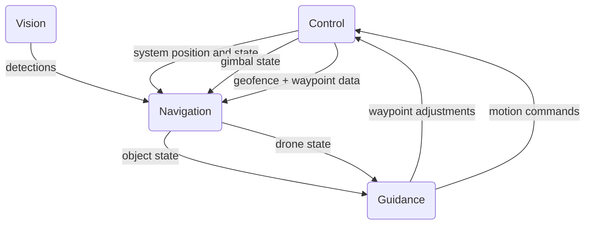

```mermaid

graph TD

c(Control)
g(Guidance)
n(Navigation)
v(Vision)

c --> |system position and state| n
v --> |detections| n
g --> |waypoint adjustments| c 
g --> |motion commands| c

c --> |gimbal state| n

n --> |object state| g
n --> |drone state| g

c --> |geofence + waypoint data| n

```
